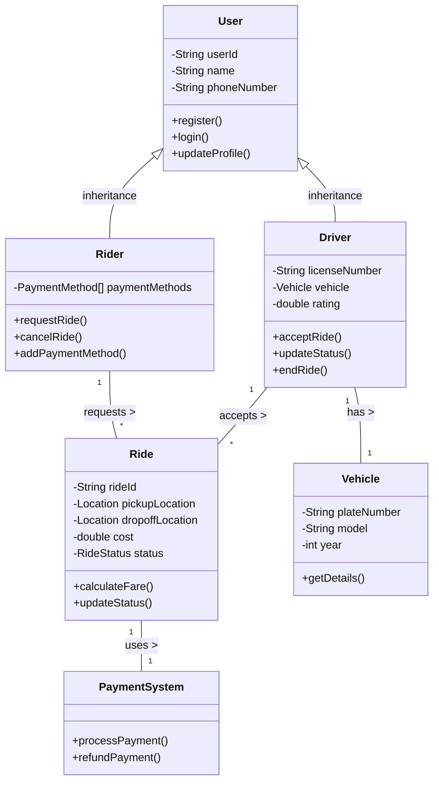
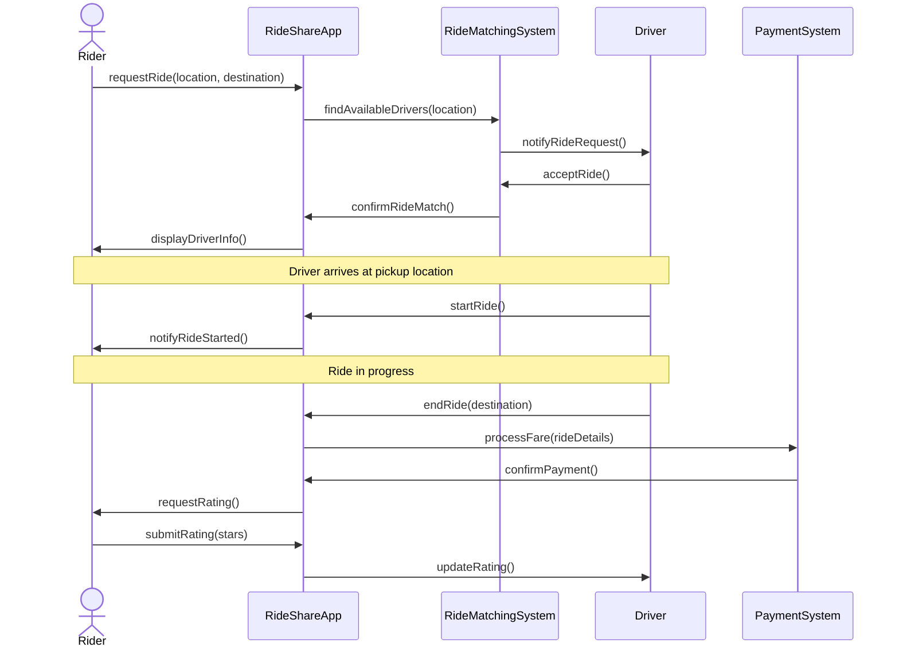
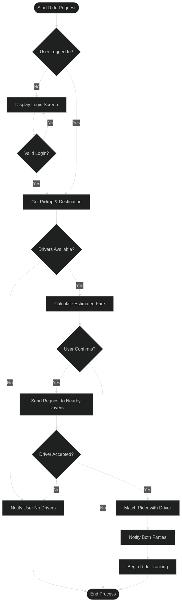

# Proposal Phase 3

The following section includes detailed design document (Something every engineer will spend a lot of time on. Often the more time spent here the less time it takes to get the project work complete as you will save time by avoiding creating project elements that you may just have to throw out or redo)

## High Level Architecture - Summary

This section will most likely be hard to create.

See [this document](https://drawio-app.com/blog/3-diagrams-every-computer-science-student-should-know) on some high level architecture diagrams that you can consider creating. We'll review and go over some of these in class as well. Feel free to add other **standard** software design diagrams as appropriate to your project.

Ask yourself, “What is the difficult part about the project? How will I solve that problem?” If there is nothing difficult about the project, then the project may not be complex enough. If you don’t know how to solve the problem, ask, “How will I learn to solve that problem?” Explain all of that here.

Lastly, consider what classes you will create, their roles & responsibilities, how your classes will interface with one another, where data will come from, and what data structures will be used. If there are lots of data sources and paths, making a diagram can help add clarity. Many projects will not require a Data Flow Diagram.

## Diagrams

You should consider at a minimum to create the following diagrams. You could consider using [Mermaid](https://mermaid.live/) to create them; search up what you can do at [this link!](https://mermaid.js.org/intro/) 




**Class Diagram**: This diagram illustrates the static structure of a system by showing its classes, attributes, operations, and the relationships among objects. It provides a clear blueprint of the system's architecture, essential for understanding how different components interact. There is an excellent reference and example on how to create class diagrams [here](https://www.visual-paradigm.com/guide/uml-unified-modeling-language/what-is-class-diagram/). You can also read more about them on [GeeksForGeeks](https://www.geeksforgeeks.org/unified-modeling-language-uml-class-diagrams/).

<details>
  <summary>Click to view Mermaid code</summary>
  <pre><code>
    classDiagram
        class User {
            -String userId
            -String name
            -String phoneNumber
            +register()
            +login()
            +updateProfile()
        }
        
        class Rider {
            -PaymentMethod[] paymentMethods
            +requestRide()
            +cancelRide()
            +addPaymentMethod()
        }
        
        class Driver {
            -String licenseNumber
            -Vehicle vehicle
            -double rating
            +acceptRide()
            +updateStatus()
            +endRide()
        }
        
        class Ride {
            -String rideId
            -Location pickupLocation
            -Location dropoffLocation
            -double cost
            -RideStatus status
            +calculateFare()
            +updateStatus()
        }
        
        class Vehicle {
            -String plateNumber
            -String model
            -int year
            +getDetails()
        }
        
        class PaymentSystem {
            +processPayment()
            +refundPayment()
        }
        
        User <|-- Rider : inheritance
        User <|-- Driver : inheritance
        Driver "1" -- "1" Vehicle : has >
        Rider "1" -- "*" Ride : requests >
        Driver "1" -- "*" Ride : accepts >
        Ride "1" -- "1" PaymentSystem : uses >
</code></pre>
</details>



**Diagram Elements:**
- **Boxes**: Classes with their properties and methods
  - Upper section: Class name
  - Middle section: Properties/attributes with `-` for private and `+` for public
  - Lower section: Methods/operations
- **Arrows**:
  - `<|--`: Inheritance relationship (Rider and Driver inherit from User)
  - `--`: Association relationship with navigation direction (`>`)
  - `"1"` and `"*"`: Multiplicity/cardinality (1-to-1 or 1-to-many)



**Sequence Diagram**: Depicting the sequence of messages exchanged among objects, sequence diagrams detail how operations are carried out, including the order of interactions. They are instrumental in modeling the dynamic behavior of a system, especially for complex processes. You can also read more about them on [GeeksForGeeks](https://www.geeksforgeeks.org/unified-modeling-language-uml-sequence-diagrams/).

<details>
  <summary>Click to view Mermaid code</summary>
  <pre><code>
sequenceDiagram
    actor R as Rider
    participant App as RideShareApp
    participant S as RideMatchingSystem
    participant D as Driver
    participant P as PaymentSystem
    
    R->>App: requestRide(location, destination)
    App->>S: findAvailableDrivers(location)
    S->>D: notifyRideRequest()
    D->>S: acceptRide()
    S->>App: confirmRideMatch()
    App->>R: displayDriverInfo()
    
    Note over R,D: Driver arrives at pickup location
    
    D->>App: startRide()
    App->>R: notifyRideStarted()
    
    Note over R,D: Ride in progress
    
    D->>App: endRide(destination)
    App->>P: processFare(rideDetails)
    P->>App: confirmPayment()
    App->>R: requestRating()
    R->>App: submitRating(stars)
    App->>D: updateRating()
</code></pre>
</details>




**Diagram Elements:**
- **Actors**: External entities (Rider)
- **Participants**: System components (App, Driver, etc.)
- **Arrows with Text**: Messages between participants
  - `->`: Synchronous message (sender waits for response)
  - `-->`: Response/return message
  - `->>`: Asynchronous message (sender doesn't wait)
- **Notes**: Additional context or explanations
- **Vertical Lines**: Lifelines showing object existence over time



**Flow Chart Diagram**: A flowchart diagram in a detailed design document shows the step-by-step logic of a process or method. It uses shapes like diamonds (decisions) and rectangles (actions) to represent control flow. Flowcharts are ideal for illustrating branching paths, loops, or procedural algorithms. They help readers visualize how specific game features or functions work internally. Use them when the logic is too complex for plain text or pseudocode alone. You can also read more about them on [GeeksForGeeks](https://www.geeksforgeeks.org/an-introduction-to-flowcharts/).


<details>
  <summary>Click to view Mermaid code</summary>
  <pre><code>
flowchart TD
  Start([Start Ride Request]) --> CheckUser{User Logged In?}
  CheckUser -- No --> Login[Display Login Screen]
  Login --> ValidateUser{Valid Login?}
  ValidateUser -- No --> Login
  ValidateUser -- Yes --> GetLocations
  CheckUser -- Yes --> GetLocations[Get Pickup & Destination]
  GetLocations --> CheckAvailable{Drivers Available?}
  CheckAvailable -- No --> Notify[Notify User No Drivers]
  Notify --> End([End Process])
  CheckAvailable -- Yes --> CalculateFare[Calculate Estimated Fare]
  CalculateFare --> ConfirmRequest{User Confirms?}
  ConfirmRequest -- No --> End
  ConfirmRequest -- Yes --> SendRequests[Send Request to Nearby Drivers]
  SendRequests --> WaitForAccept{Driver Accepted?}
  WaitForAccept -- No --> Notify
  WaitForAccept -- Yes --> MatchRide[Match Rider with Driver]
  MatchRide --> NotifyBoth[Notify Both Parties]
  NotifyBoth --> TrackRide[Begin Ride Tracking]
  TrackRide --> End
</code></pre>
</details>



**Diagram Elements:**
- **Rounded Rectangles with Square Brackets `[]`**: Process steps/actions
- **Diamonds with Curly Braces `{}`**: Decision points with multiple paths
- **Rounded Capsules with Parentheses `([])`**: Start/End points
- **Arrows**: Flow direction
  - Plain arrows: Standard flow
  - Labeled arrows: Conditional paths (e.g., "Yes", "No")
- **Vertical Arrangement**: Time/sequence flows from top to bottom
- **Horizontal Branches**: Alternative paths based on decisions



Depending on the features and/or scope of your project, you may want to include other kinda of diagrams as well. Listed below are a few examples, along with some use cases for them. Feel free to look other ones up!

**Data Flow Diagrams:** Shows how data moves through your application, identifying inputs, processes, outputs, and storage locations. It helps clarify data dependencies and processing requirements. You can read more about them on [GeeksForGeeks](https://www.geeksforgeeks.org/what-is-dfddata-flow-diagram/).

**When to use**: For applications with complex data processing, especially those dealing with multiple data sources, transformations, and storage systems. Ideal for:
- Data-intensive applications (analytics platforms, ETL systems)
- Applications with multiple external interfaces (payment gateways, APIs)
- Systems with complex business logic processing

Here's an example for a customer buying something from a store. (from [Canva](https://www.canva.com/online-whiteboard/data-flow-diagrams/))


**State Diagrams:** Shows the different states an object can be in and how events trigger transitions between these states. They're particularly valuable when behavior changes significantly based on state. You can read more about them on [GeeksForGeeks](https://www.geeksforgeeks.org/unified-modeling-language-uml-state-diagrams/).

**When to use**: For systems with distinct states and transitions, such as:
- Game development (character states, game progression)
- Workflow applications (document approval processes)
- Systems with complex life cycles (order processing, user account management)

Here's an example for a Bank ATM. (from [BizzDesign](https://help.bizzdesign.com/articles/#!horizzon-help/modeling-a-uml-state-diagram))






## Class Roles & Responsibilities

Builing on the diagrams you created in the last section you should expand on the details for as many of your classes that you can identify and their roles & responsibilities. It could be that that will be enough. If you cannot list off at least three classes, the project is not complex enough.

Here's an example:

| Class name | Roles & Responsibilities |
| :---- | :---- |
| `GameController` | - Initializes and manages the overall game state<br>- Handles the game loop (update, render cycle)<br>- Coordinates communication between UI, game logic, and data storage<br>- Manages transitions between different game screens |
| `Player` | - Stores player attributes (position, health, inventory, etc.)<br>- Handles player input and movement logic<br>- Contains methods for player actions (attack, use item, etc.)<br>- Tracks player progression and statistics |
| `MapGenerator` | - Creates and manages the game world/levels<br>- Implements procedural generation algorithms for terrain<br>- Places objects, enemies, and collectibles on the map<br>- Handles map persistence and loading |
| `EnemyAI` | - Controls enemy behavior and decision-making<br>- Implements pathfinding to navigate toward the player<br>- Manages enemy attacks and special abilities<br>- Handles enemy spawning and difficulty scaling |
| `UIManager` | - Renders all user interface elements<br>- Handles UI input and interaction<br>- Manages menus, HUD, and dialog systems<br>- Updates UI based on game state changes |

## Important Algorithms/Functionality

Clearly documenting key algorithms is essential for ensuring a well-structured and efficient implementation of your project. This section should highlight any complex or critical algorithms that will be developed, such as game loops, AI decision-making, pathfinding, data processing, or physics simulations.  

**Why is this important?**  
- It helps identify potential challenges early, allowing for better planning and problem-solving before coding begins.  
- Ensures consistency in implementation, especially when working in a team, by providing a shared understanding of how key functionalities will operate.  
- Serves as a reference throughout development, reducing confusion and making debugging more efficient.  
- Helps prevent scope creep by defining the complexity of features in advance.  

**How detailed should this section be?**  
- Provide a high-level explanation of what the algorithm does and why it’s needed.  
- Include a brief outline of the logic or steps involved (pseudocode or flowcharts can be useful but should remain concise).  
- If applicable, mention key considerations like efficiency, potential bottlenecks, or alternative approaches.  
- Avoid excessive detail—this is not a full implementation but rather a roadmap for development.  

{: .example }
> **AI Pathfinding** - The AI will use pathfinding to navigate around obstacles. The algorithm will work by evaluating possible movement nodes based on a heuristic function (estimated distance to the > goal) and the actual movement cost. This ensures the AI finds the shortest path efficiently. We will precompute walkable areas and optimize performance by limiting path recalculations.

{: .mx-8 }
{: .px-8 }
```mermaid
 flowchart TD
     A[Start Pathfinding] --> B{Is Goal Reached?}
     B -- Yes --> G[End Pathfinding]
     B -- No --> C[Get Walkable Neighbors of Current Node]
     C --> H["Score Neighbors<br>& select lowest total"]
     H --> I{Recalculation Needed?}
     I -- No --> J[Move to Next Node]
     I -- Yes --> K[Recalculate Limited Path]
     K --> J
     J --> B
 ```

This level of detail provides enough guidance without overwhelming the design document with unnecessary complexity.

## Approval

You must receive teacher approval to begin coding.

